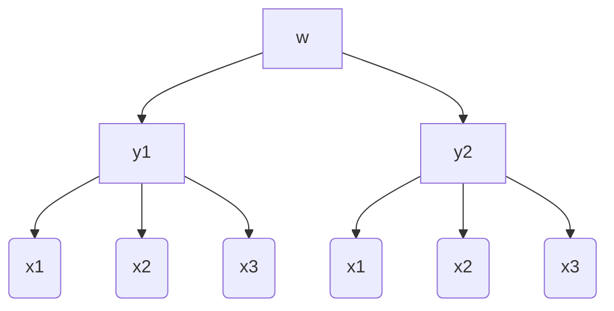

# Segunda avaliação

## Primeira questão

Derivando $x_1$, $x_2$ e $x_1$ com $y_1$ constante

para $x_1$: 
$\frac{\partial }{\partial y_2}(a_1\cdot y_1 + b_1\cdot y_2) = b_1$

para $x_2$ :
$\frac{\partial }{\partial y_2}(a_2\cdot y_1 + b_2\cdot y_2) = b_2$

para $x_3$ :
$\frac{\partial }{\partial y_2}(a_3\cdot y_1 + b_3\cdot y_2) = b_3$

Derivando $x_1$, $x_2$ e $x_1$ com $y_2$ constante

para $x_1$: 
$\frac{\partial }{\partial y_1}(a_1\cdot y_1 + b_1\cdot y_2) = a_1$

para $x_2$ :
$\frac{\partial }{\partial y_1}(a_2\cdot y_1 + b_2\cdot y_2) = a_2$

para $x_3$ :
$\frac{\partial }{\partial y_1}(a_3\cdot y_1 + b_3\cdot y_2) = a_3$

Diagrama da arvore:

$\frac{\partial w}{\partial y_1} =$
$\frac{\partial w}{\partial x_1} \frac{\partial x_1}{\partial y_1}+$
$\frac{\partial w}{\partial x_2} \frac{\partial x_2}{\partial y_1}+$
$\frac{\partial w}{\partial x_3} \frac{\partial x_3}{\partial y_1}$

$\frac{\partial w}{\partial y_2} =$
$\frac{\partial w}{\partial x_1} \frac{\partial x_1}{\partial y_2}+$
$\frac{\partial w}{\partial x_2} \frac{\partial x_2}{\partial y_2}+$
$\frac{\partial w}{\partial x_3} \frac{\partial x_3}{\partial y_2}$

Substituindo os valores das derivadas:

$\frac{\partial w}{\partial y_1} =$
$\frac{\partial w}{\partial x_1} a_1+$
$\frac{\partial w}{\partial x_2} a_2+$
$\frac{\partial w}{\partial x_3} a_3$
e
$\frac{\partial w}{\partial y_2} =$
$\frac{\partial w}{\partial x_1} b_1+$
$\frac{\partial w}{\partial x_2} b_2+$
$\frac{\partial w}{\partial x_3} b_3$

## Segunda questão

### Calculando a Derivada direcional:

Determinando o vetor gradiente:

$\nabla T(x,y,z) = \frac{\partial T}{\partial x},\frac{\partial T}{\partial y}, \frac{\partial T}{\partial z} $

$\frac{\partial T}{\partial x} = \frac{yz(-x^2+y^2+z^2+1)}{(1+x^2+y^2+z^2)^2}$

$\frac{\partial T}{\partial y} = \frac{xz(-y^2+x^2+z^2+1)}{(1+x^2+y^2+z^2)^2}$

$\frac{\partial T}{\partial z} = \frac{xy(1+x^2+y^2-z^2)}{(1+x^2+y^2+z^2)^2}$

Substituindo $\nabla T(1,1,1)$:

$\nabla T(1,1,1) = \frac{1\cdot 1(-1^2+1^2+1^2+1)}{(1+1^2+1^2+1^2)^2}, \frac{1\cdot 1(-1^2+1^2+1^2+1)}{(1+1^2+1^2+1^2)^2}, \frac{1\cdot 1(1+1^2+1^2-1^2)}{(1+1^2+1^2+1^2)^2}$

$\nabla T(1,1,1) = \frac{1}{8},\frac{1}{8},\frac{1}{8}$

Determinando o vetor uniário u em direção a origem(0,0,0):

$|u| = \sqrt{-1^2 + -1^2 + -1^2} = |u| = 3$

$u = <\frac{1}{\sqrt{3}},\frac{1}{\sqrt{3}},\frac{1}{\sqrt{3}}>$

Determinando a variação em 1,1,1:

$\frac{\partial T}{\partial u} = \nabla T(x,y,z) \cdot u$

$\frac{\partial T}{\partial u} = <1,1,1>\cdot <\frac{1}{\sqrt{3}},\frac{1}{\sqrt{3}},\frac{1}{\sqrt{3}}>$

$\frac{1}{\sqrt{3}}+\frac{1}{\sqrt{3}}+\frac{1}{\sqrt{3}} = \frac{3}{\sqrt{3}}$

A taxa de variação de 1,1,1 em direção a origem é $\frac{3}{\sqrt{3}}$

A direção na qual a variação a temperatura aumenta mais rapidamente é $<1,1,1>$

